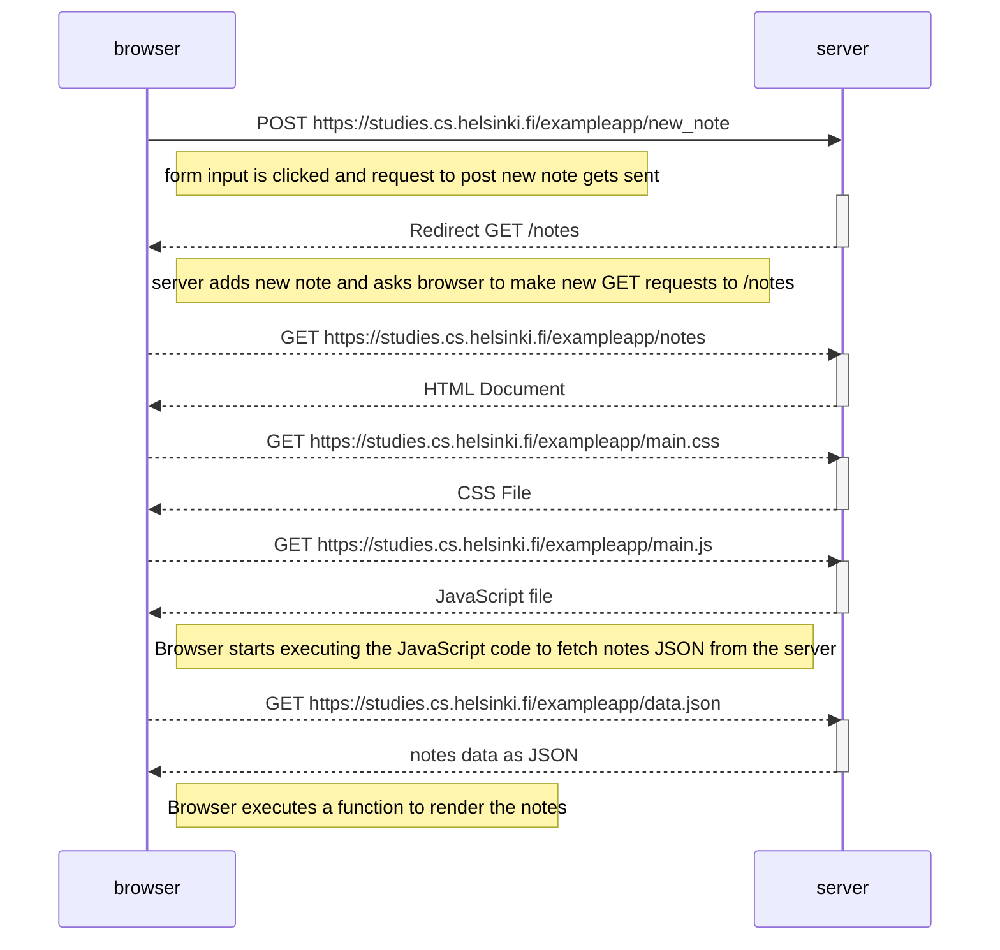

```mermaid
    sequenceDiagram;
    participant browser
    participant server
browser->>server: POST https://studies.cs.helsinki.fi/exampleapp/new_note
note right of browser: form input is clicked and request to post new note gets sent
activate server
server -->> browser: Redirect GET /notes
deactivate server
note right of browser: server adds new note and asks browser to make new GET requests to /notes
browser-->>server: GET https://studies.cs.helsinki.fi/exampleapp/notes
activate server
server-->>browser: HTML Document
deactivate server
browser-->>server: GET https://studies.cs.helsinki.fi/exampleapp/main.css
activate server
server-->>browser: CSS File
deactivate server
browser-->>server: GET https://studies.cs.helsinki.fi/exampleapp/main.js
activate  server
server-->>browser: JavaScript file
deactivate server
Note right of browser: Browser starts executing the JavaScript code to fetch notes JSON from the server
browser-->>server: GET https://studies.cs.helsinki.fi/exampleapp/data.json
activate server
server-->>browser: notes data as JSON
deactivate server
Note right of browser: Browser executes a function to render the notes

```
