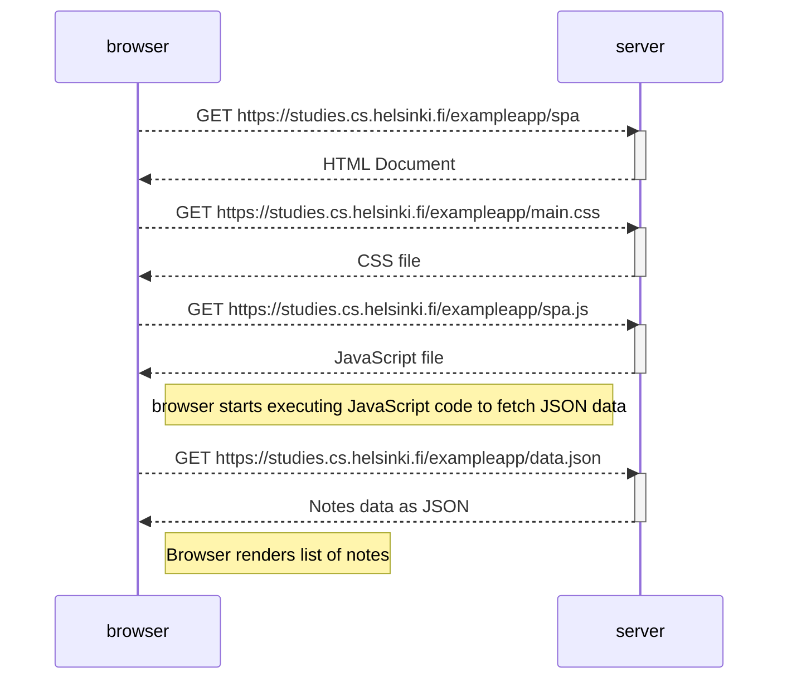

```mermaid
sequenceDiagram
participant browser
participant server
browser-->>server: GET https://studies.cs.helsinki.fi/exampleapp/spa
activate server
server-->>browser: HTML Document
deactivate server
browser-->>server: GET https://studies.cs.helsinki.fi/exampleapp/main.css
activate server
server-->>browser: CSS file
deactivate server
browser-->>server: GET https://studies.cs.helsinki.fi/exampleapp/spa.js
activate server
server-->>browser: JavaScript file
deactivate server
note right of browser: browser starts executing JavaScript code to fetch JSON data
browser-->>server: GET https://studies.cs.helsinki.fi/exampleapp/data.json
activate server
server-->>browser: Notes data as JSON
deactivate server
note right of browser: Browser renders list of notes
```
